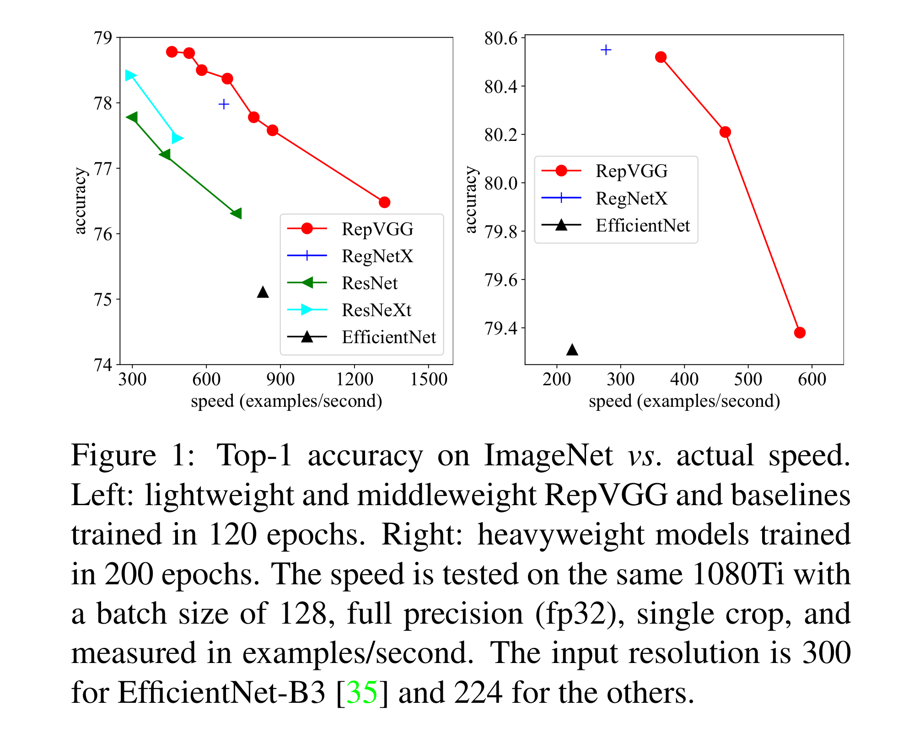
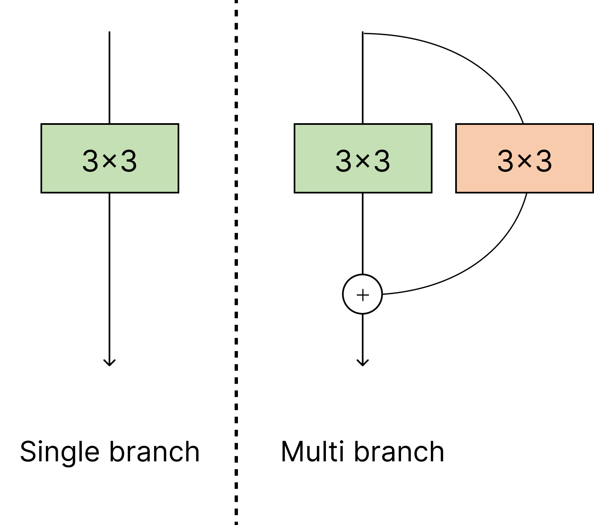
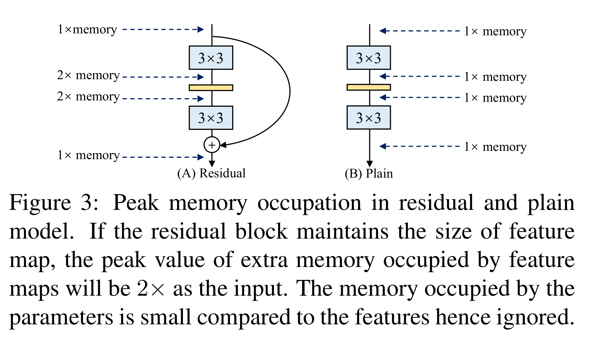
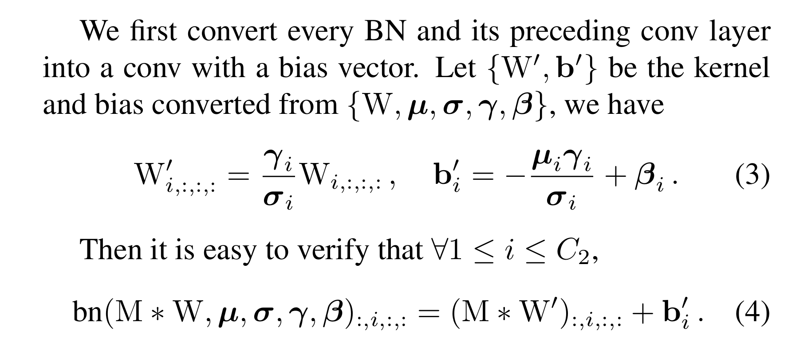
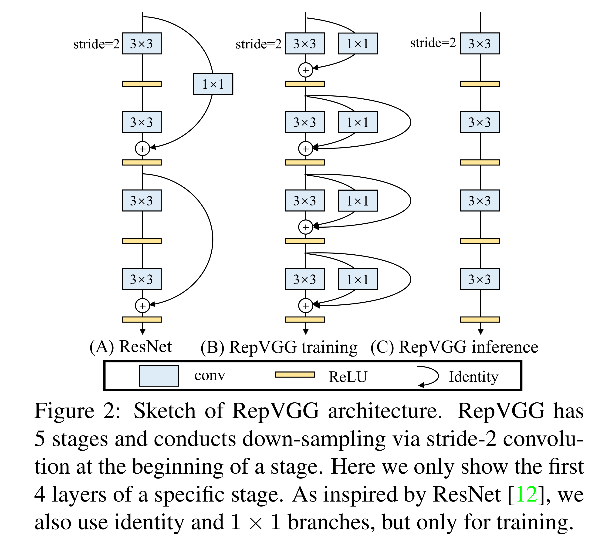
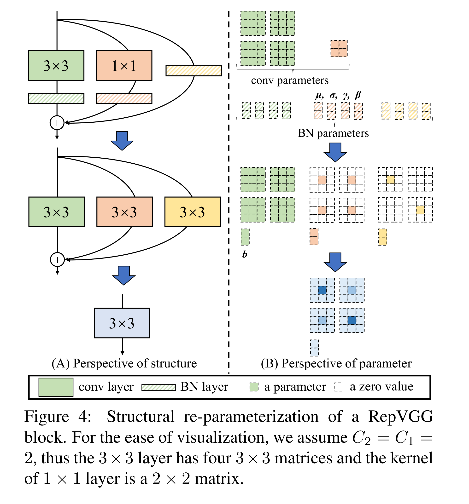
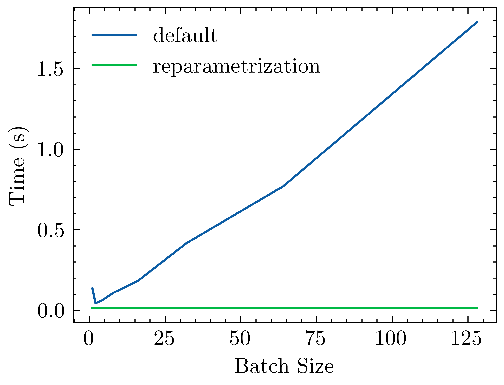

# Implementing RepVGG in PyTorch
## Make your cnn > 100x faster!

Hello There!! Today we’ll see how to implement RepVGG in PyTorch proposed in [RepVGG: Making VGG-style ConvNets Great Again](https://arxiv.org/pdf/2101.03697.pdf)

Code is [here](https://github.com/FrancescoSaverioZuppichini/RepVgg), an interactive version of this article can be downloaded from [here](https://github.com/FrancescoSaverioZuppichini/RepVgg/blob/main/README.ipynb).

Let’s get started!

The paper proposed a new architecture that can be tuned after training to make it faster on modern hardware. And by faster I mean lighting fast, this idea was used by [Apple's MobileOne model].(https://arxiv.org/abs/2206.04040).




## Single vs Multi Branch Models

A lot of recent models use multi-branching, where the input is passed through different layers and then aggregated somehow (usually with addition).




This is great because it makes the multi-branch model an implicit ensemble of numerous shallower models. More specifically, *the model can be interpreted as an ensemble of 2^n models since every block branches the flow into two paths.*

Unfortunately, multi-branch models consume more memory and are slower compared to single branch ones. Let's create a classic `ResNetBlock` to see why.


```python
import torch
from torch import nn, Tensor
from torchvision.ops import Conv2dNormActivation
from typing import Dict, List

torch.manual_seed(0)


class ResNetBlock(nn.Module):
    def __init__(self, in_channels: int, out_channels: int, stride: int = 1):
        super().__init__()
        self.weight = nn.Sequential(
            Conv2dNormActivation(
                in_channels, out_channels, kernel_size=3, stride=stride
            ),
            Conv2dNormActivation(
                out_channels, out_channels, kernel_size=3, activation_layer=None
            ),
        )
        self.shortcut = (
            Conv2dNormActivation(
                in_channels,
                out_channels,
                kernel_size=1,
                stride=stride,
                activation_layer=None,
            )
            if in_channels != out_channels
            else nn.Identity()
        )

        self.act = nn.ReLU(inplace=True)

    def forward(self, x):
        res = self.shortcut(x)  # <- 2x memory
        x = self.weight(x)
        x += res
        x = self.act(x)  # <- 1x memory
        return x
```

Storing the `residual` double memory consumption. This is also shown in the following image from the paper




The authors noticed that the **multi branch architecture is useful only at train time**. Thus, if we can have a way to remove it at test time we can improve the model speed and memory consumption.


### From Multi Branches to Single Branch

Consider the following situation, you have two branches composed of two `3x3` convs


```python
class TwoBranches(nn.Module):
    def __init__(self, in_channels: int, out_channels: int):
        super().__init__()
        self.conv1 = nn.Conv2d(in_channels, out_channels, kernel_size=3)
        self.conv2 = nn.Conv2d(in_channels, out_channels, kernel_size=3)
        
    def forward(self, x):
        x1 = self.conv1(x)
        x2 = self.conv2(x)
        return x1 + x2
```


```python
two_branches = TwoBranches(8, 8)

x = torch.randn((1, 8, 7, 7))

two_branches(x).shape
```


    torch.Size([1, 8, 5, 5])


Now, we can create one conv, let's call it `conv_fused` such that `conv_fused(x) = conv1(x) + conv2(x)`. Very easily, we can just sum up the `weight`s and the `bias` of the two convs! Thus we only need to run one `conv` instead of two.


```python
conv1 = two_branches.conv1
conv2 = two_branches.conv2

conv_fused = nn.Conv2d(conv1.in_channels, conv1.out_channels, kernel_size=conv1.kernel_size)

conv_fused.weight = nn.Parameter(conv1.weight + conv2.weight)
conv_fused.bias =  nn.Parameter(conv1.bias + conv2.bias)

# check they give the same output
assert torch.allclose(two_branches(x), conv_fused(x), atol=1e-5)
```

Let's see how much faster it is!


```python
from time import perf_counter

two_branches.to("cuda")
conv_fused.to("cuda")

with torch.no_grad():
    x = torch.randn((4, 8, 7, 7), device=torch.device("cuda"))
    
    start = perf_counter()
    two_branches(x)
    print(f"conv1(x) + conv2(x) tooks {perf_counter() - start:.6f}s")
    
    start = perf_counter()
    conv_fused(x)
    print(f"conv_fused(x) tooks {perf_counter() - start:.6f}s")

```

    conv1(x) + conv2(x) tooks 0.000421s
    conv_fused(x) tooks 0.000215s


Almost `50%` less (keep in mind this is a very naive benchmark, we will see a better one later on)

### Fuse Conv and BatchNorm

In modern network architectures, `BatchNorm` is used as a regularization layer after a convolution block. We may want to fused them together, so create a conv such that `conv_fused(x) = batchnorm(conv(x))`. The idea is to change the weights of `conv` in order to incorporation the shifting and scaling from `BatchNorm`. 

The paper explains it as follows:



The code is the following:


```python
def get_fused_bn_to_conv_state_dict(
    conv: nn.Conv2d, bn: nn.BatchNorm2d
) -> Dict[str, Tensor]:
    # in the paper, weights is gamma and bias is beta
    bn_mean, bn_var, bn_gamma, bn_beta = (
        bn.running_mean,
        bn.running_var,
        bn.weight,
        bn.bias,
    )
    # we need the std!
    bn_std = (bn_var + bn.eps).sqrt()
    # eq (3)
    conv_weight = nn.Parameter((bn_gamma / bn_std).reshape(-1, 1, 1, 1) * conv.weight)
    # still eq (3)
    conv_bias = nn.Parameter(bn_beta - bn_mean * bn_gamma / bn_std)
    return {"weight": conv_weight, "bias": conv_bias}
```

Let's see if it works


```python
conv_bn = nn.Sequential(
    nn.Conv2d(8, 8, kernel_size=3, bias=False),
    nn.BatchNorm2d(8)
)

torch.nn.init.uniform_(conv_bn[1].weight)
torch.nn.init.uniform_(conv_bn[1].bias)

with torch.no_grad():
    # be sure to switch to eval mode!!
    conv_bn = conv_bn.eval()
    conv_fused = nn.Conv2d(conv_bn[0].in_channels, 
                           conv_bn[0].out_channels, 
                           kernel_size=conv_bn[0].kernel_size)

    conv_fused.load_state_dict(get_fused_bn_to_conv_state_dict(conv_bn[0], conv_bn[1]))

    x = torch.randn((1, 8, 7, 7))
    
    assert torch.allclose(conv_bn(x), conv_fused(x), atol=1e-5)
```

yes, we fused a `Conv2d` and a `BatchNorm2d` layer. There is also an [article from PyTorch about this](https://pytorch.org/tutorials/intermediate/custom_function_conv_bn_tutorial.html) 


So our goal is to fuse all the branches in one single conv, making the network faster! 

The author proposed a new type of block, called `RepVGG`. Similar to ResNet, it has a shortcut but it also has an identity connection (or better branch).




In PyTorch:


```python
class RepVGGBlock(nn.Module):
    def __init__(self, in_channels: int, out_channels: int, stride: int = 1):
        super().__init__()
        self.block = Conv2dNormActivation(
            in_channels,
            out_channels,
            kernel_size=3,
            padding=1,
            bias=False,
            stride=stride,
            activation_layer=None,
            # the original model may also have groups > 1
        )

        self.shortcut = Conv2dNormActivation(
            in_channels,
            out_channels,
            kernel_size=1,
            stride=stride,
            activation_layer=None,
        )

        self.identity = (
            nn.BatchNorm2d(out_channels) if in_channels == out_channels else None
        )

        self.relu = nn.ReLU(inplace=True)

    def forward(self, x):
        res = x  # <- 2x memory
        x = self.block(x)
        x += self.shortcut(res)
        if self.identity:
            x += self.identity(res)
        x = self.relu(x)  # <- 1x memory
        return x
```

#### Reparametrization

We have one `3x3` `conv->bn`, one `1x1` `conv-bn` and (somethimes) one `batchnorm` (the identity branch). We want to fused them together to create one single `conv_fused` such that `conv_fused` = `3x3conv-bn(x) + 1x1conv-bn(x) + bn(x)` or if we don't have an identity connection, `conv_fused` = `3x3conv-bn(x) + 1x1conv-bn(x)`.

Let's go step by step. To create `conv_fused` we have to:
- fuse the `3x3conv-bn(x)` into one `3x3conv`
- `1x1conv-bn(x)`, then convert it to a `3x3conv`
- convert the identity, `bn`, to a `3x3conv`
- add all the three `3x3conv`s

Summarized by the image below:



The first step it's easy, we can use `get_fused_bn_to_conv_state_dict` on `RepVGGBlock.block` (the main `3x3 conv-bn`).

The second step is similar, `get_fused_bn_to_conv_state_dict` on `RepVGGBlock.shortcut` (the `1x1 conv-bn`). Then we pad each kernel of the fused `1x1` by `1` in each dimension creating a `3x3`.

The identity `bn` is trickier. We need to create a `3x3` `conv` that will act as an identity function and then use `get_fused_bn_to_conv_state_dict` to fuse it with the identity `bn`. This can be done by having `1` in the center of the corresponding kernel for that corresponding channel. 

Recall that a conv's weight is a tensor of `in_channels, out_channels, kernel_h, kernel_w`. If we want to create an identity conv, such that `conv(x) = x`, we need to have one single `1` for that channel.

For example:


```python
with torch.no_grad():
    x = torch.randn((1,2,3,3))
    identity_conv = nn.Conv2d(2,2,kernel_size=3, padding=1, bias=False)
    identity_conv.weight.zero_()
    print(identity_conv.weight.shape)

    in_channels = identity_conv.in_channels
    for i in range(in_channels):
        identity_conv.weight[i, i % in_channels, 1, 1] = 1

    print(identity_conv.weight)
    
    out = identity_conv(x)
    assert torch.allclose(x, out)
```

    torch.Size([2, 2, 3, 3])
    Parameter containing:
    tensor([[[[0., 0., 0.],
              [0., 1., 0.],
              [0., 0., 0.]],
    
             [[0., 0., 0.],
              [0., 0., 0.],
              [0., 0., 0.]]],
    
    
            [[[0., 0., 0.],
              [0., 0., 0.],
              [0., 0., 0.]],
    
             [[0., 0., 0.],
              [0., 1., 0.],
              [0., 0., 0.]]]], requires_grad=True)


See, we created a `Conv` that acts like an identity function. 

Now, putting everything together, this step if formally called **reparametrization**


```python
def get_fused_conv_state_dict_from_block(block: RepVGGBlock) -> Dict[str, Tensor]:
    fused_block_conv_state_dict = get_fused_bn_to_conv_state_dict(
        block.block[0], block.block[1]
    )

    if block.shortcut:
        # fuse the 1x1 shortcut
        conv_1x1_state_dict = get_fused_bn_to_conv_state_dict(
            block.shortcut[0], block.shortcut[1]
        )
        # we pad the 1x1 to a 3x3
        conv_1x1_state_dict["weight"] = torch.nn.functional.pad(
            conv_1x1_state_dict["weight"], [1, 1, 1, 1]
        )
        fused_block_conv_state_dict["weight"] += conv_1x1_state_dict["weight"]
        fused_block_conv_state_dict["bias"] += conv_1x1_state_dict["bias"]
    if block.identity:
        # create our identity 3x3 conv kernel
        identify_conv = nn.Conv2d(
            block.block[0].in_channels,
            block.block[0].in_channels,
            kernel_size=3,
            bias=True,
            padding=1,
        ).to(block.block[0].weight.device)
        # set them to zero!
        identify_conv.weight.zero_()
        # set the middle element to zero for the right channel
        in_channels = identify_conv.in_channels
        for i in range(identify_conv.in_channels):
            identify_conv.weight[i, i % in_channels, 1, 1] = 1
        # fuse the 3x3 identity
        identity_state_dict = get_fused_bn_to_conv_state_dict(
            identify_conv, block.identity
        )
        fused_block_conv_state_dict["weight"] += identity_state_dict["weight"]
        fused_block_conv_state_dict["bias"] += identity_state_dict["bias"]

    fused_conv_state_dict = {
        k: nn.Parameter(v) for k, v in fused_block_conv_state_dict.items()
    }

    return fused_conv_state_dict
```

Finally, let's define a `RepVGGFastBlock`. It's only composed by a `conv + relu` 🤩


```python
class RepVGGFastBlock(nn.Sequential):
    def __init__(self, in_channels: int, out_channels: int, stride: int = 1):
        super().__init__()
        self.conv = nn.Conv2d(
            in_channels, out_channels, kernel_size=3, stride=stride, padding=1
        )
        self.relu = nn.ReLU(inplace=True)
```

and add a `to_fast` method to `RepVGGBlock` to quickly create the correct `RepVGGFastBlock`


```python
class RepVGGBlock(nn.Module):
    def __init__(self, in_channels: int, out_channels: int, stride: int = 1):
        super().__init__()
        self.block = Conv2dNormActivation(
            in_channels,
            out_channels,
            kernel_size=3,
            padding=1,
            bias=False,
            stride=stride,
            activation_layer=None,
            # the original model may also have groups > 1
        )

        self.shortcut = Conv2dNormActivation(
            in_channels,
            out_channels,
            kernel_size=1,
            stride=stride,
            activation_layer=None,
        )

        self.identity = (
            nn.BatchNorm2d(out_channels) if in_channels == out_channels else None
        )

        self.relu = nn.ReLU(inplace=True)

    def forward(self, x):
        res = x  # <- 2x memory
        x = self.block(x)
        x += self.shortcut(res)
        if self.identity:
            x += self.identity(res)
        x = self.relu(x)  # <- 1x memory
        return x

    def to_fast(self) -> RepVGGFastBlock:
        fused_conv_state_dict = get_fused_conv_state_dict_from_block(self)
        fast_block = RepVGGFastBlock(
            self.block[0].in_channels,
            self.block[0].out_channels,
            stride=self.block[0].stride,
        )

        fast_block.conv.load_state_dict(fused_conv_state_dict)

        return fast_block
```

### RepVGG

Let's define `RepVGGStage` (collection of blocks) and `RepVGG` with an handy `switch_to_fast` method that will swith to the fast block in-place:


```python
class RepVGGStage(nn.Sequential):
    def __init__(
        self,
        in_channels: int,
        out_channels: int,
        depth: int,
    ):
        super().__init__(
            RepVGGBlock(in_channels, out_channels, stride=2),
            *[RepVGGBlock(out_channels, out_channels) for _ in range(depth - 1)],
        )


class RepVGG(nn.Sequential):
    def __init__(self, widths: List[int], depths: List[int], in_channels: int = 3):
        super().__init__()
        in_out_channels = zip(widths, widths[1:])

        self.stages = nn.Sequential(
            RepVGGStage(in_channels, widths[0], depth=1),
            *[
                RepVGGStage(in_channels, out_channels, depth)
                for (in_channels, out_channels), depth in zip(in_out_channels, depths)
            ],
        )

        # omit classification head for simplicity

    def switch_to_fast(self):
        for stage in self.stages:
            for i, block in enumerate(stage):
                stage[i] = block.to_fast()
        return self
```

### Let's test it out! 

I've created a benchmark inside `benchmark.py`, running the model on my **gtx 1080ti** with different batch sizes and this is the result:


The model has two layers per stage, four stages and widths of `64, 128, 256, 512`. 

In their paper, they scale these values by some amount (called `a` and `b`) and they used grouped convs. Since we are more interested in the reparametrization part, I skip them.




Yeah, so basically the reparametrization model is on a different scaled time compared to the vanilla one. Wow!

Let me copy and pasted the dataframe I used to store the benchmark

```
       Type    VRAM (B)  Time (s)  batch size device
0   Default    50207232  0.140840           1   cuda
1      Fast    48875008  0.012529           1   cuda
2   Default    53307904  0.038717           2   cuda
3      Fast    51165696  0.012565           2   cuda
4   Default    61680128  0.050138           4   cuda
5      Fast    55556608  0.012454           4   cuda
6   Default   102623744  0.101274           8   cuda
7      Fast    76430336  0.012429           8   cuda
8   Default   188377600  0.171917          16   cuda
9      Fast   135117312  0.012426          16   cuda
10  Default   368257536  0.403996          32   cuda
11     Fast   366115328  0.013461          32   cuda
12  Default   676751872  0.733245          64   cuda
13     Fast   568883712  0.013460          64   cuda
14  Default  1330932224  1.454447         128   cuda
15     Fast  1068743168  0.013548         128   cuda
```

You can see that the default model (multi branch) tooks `1.45`s for a `batch_size=128` while the reparamitizated one (fast) only took `0.0134`s.That is **108x** 🚀🚀🚀.

## Conclusions

Conclusions
In this article we have seen, step by step, how to create RepVGG; a blaziling fast model using a smart reparameterization technique. 

This technique can be ported to other architecture as well.

Thank you for reading it!

Francesco


